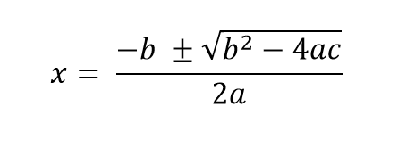

# Solve the Quadratic Equation

A quadratic equation is a second order equation written as ax2 + bx + c = 0 where a, b, and c are coefficients of real numbers and a ≠ 0.

The quadratic formula is a general formula used for solving the quadratic equation:

## Given input of a, b, and c. Solve the following equations.
(a) 2x^2 + 3x − 4 = 0

(b) x^2 + 5x − 3 = 0

[Reference](https://www.sciencedirect.com/topics/mathematics/quadratic-equation#:~:text=A%20quadratic%20equation%20is%20a,numbers%20and%20a%E2%89%A00.)
