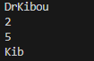

# Java Substring

Given a string, s, and two indices, start and end, print a substring consisting of all characters in the inclusive range from start to end - 1. You'll find the String class' substring method helpful in completing this challenge.

## Input Format

The first line contains a single string denoting s.
The second line contains two space-separated integers denoting the respective values of start and end.

## Constraints

1<=|s|>=100

0<=start<end<=n

String s consist of English alphabetic letters (a-zA-z) only.

## Output

Print the substring in the inclusive range from start to end - 1.

## Sample Output

--[HackerRankChallenge](https://www.hackerrank.com/challenges/java-substring/problem?isFullScreen=true)